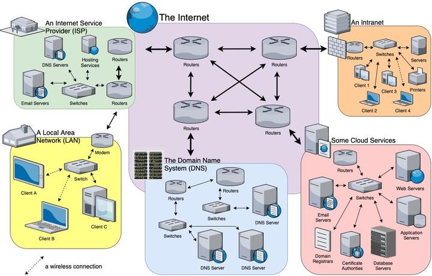

# Заняття 19

### Python + Server 

#### HTML CSS

---

__Інтерне́т__ — (міжнародна комп'ютерна мережа), 
всесвітня система сполучених комп'ютерних мереж, 
що заснована на комплекті інтернетних протоколів. 
Інтернет також називають мережею мереж, бо він 
складається з мільйонів локальних і глобальних 
приватних, публічних, академічних, ділових 
і урядових мереж, пов'язаних між собою з 
використанням різноманітних дротових, оптичних 
і бездротових технологій.
[wikipedia](https://uk.wikipedia.org/wiki/Інтернет)

### Internet Server

Інтернет-сервер — це комп’ютерна програма, яка працює 
на комп’ютері та надає послуги іншим комп’ютерам 
через Інтернет. Він діє як посередник між користувачами 
та великою мережею ресурсів, які складають Інтернет.

На стороні сервера можна використовувати різні мови 
програмування для створення веб-додатків, обробки даних, 
управління базами даних та виконання інших завдань. 

- __JavaScript__ (Node.js дозволяє виконувати JavaScript на сервері) 

- __Python__ (Легка у вивченні мова з широким вибором фреймворків, таких як Flask, Django та FastAPI)

- __PHP__ (Одна з найпоширеніших мов для веб-розробки, особливо для створення динамічних веб-сайтів) 

- __JAVA__ (Використовується для створення масштабованих та надійних серверних додатків)

- __C#__ (Мова програмування від Microsoft, яка зазвичай використовується з фреймворком ASP.NET)

- __Ruby__ (Використовується в основному з фреймворком Ruby on Rails)

- __Go (Golang)__ (Мова програмування, розроблена Google, відома своєю швидкістю і ефективністю)

- __Kotlin__ (Використовується в основному для Android-розробки)

> Python є потужною мовою програмування, яка широко 
> використовується для серверної розробки завдяки своїй 
> простоті, зручності у використанні та великому екосистемі 
> бібліотек і фреймворків.

Основні фреймворки та бібліотеки для серверної розробки

#### Flask

Легкий фреймворк, який дозволяє створювати прості і масштабовані 
веб-додатки. Підходить для мікросервісів.
Проста структура, розширюваність за допомогою додаткових 
модулів, підтримка шаблонів (Jinja2), хороша документація.
[Документація Flask](https://flask.palletsprojects.com/en/3.0.x/)

#### Django:

Високорівневий фреймворк, який забезпечує повний набір 
інструментів для швидкого створення веб-додатків.
Автоматичне створення адміністративного інтерфейсу, 
ORM (Object-Relational Mapping), підтримка авторизації 
та аутентифікації, підтримка URL-маршрутизації.

#### FastAPI:

Сучасний, швидкий фреймворк для створення API з автоматичною документацією.
Висока продуктивність, використання асинхронних викликів, 
підтримка типізації Python 3.6+, автоматична генерація OpenAPI 
та Swagger документації.

#### Tornado:

Асинхронний фреймворк, який підходить для створення масштабованих веб-додатків.
Підтримка WebSockets, асинхронний ввід-вивід, підходить для додатків, 
що працюють у реальному часі.

