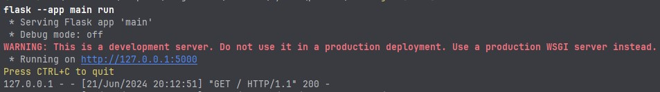

# Заняття 20-21

## Flask  

---

### 1. Повторення


[Git](ttps://www.git-scm.com/) — це безкоштовна розподілена система контролю версій із відкритим вихідним кодом, призначена для швидкої та ефективної обробки будь-яких проектів, від малих до дуже великих.

Git постачається з вбудованими інструментами графічного інтерфейсу
([GUI Clients](https://www.git-scm.com/downloads/guis)) для 
фіксації (git-gui) і перегляду (gitk), але є кілька інструментів 
сторонніх розробників.


__Деякі вебсервіси для спільної розробки програмного забезпечення:__
- [GitHub](https://github.com/)
- [GitLab](https://about.gitlab.com/)
- [Bitbucket](https://bitbucket.org/)


### 2. Робота з Flask

[Flask](https://flask.palletsprojects.com/en/3.0.x/) - Це мікро-фреймворк, написаний на Python, відрізняється своєю простотою та гнучкістю, роблячи його доступним для початківців, водночас пропонуючи потужні можливості для створення складних програм.

Перед початком роботи, відкрийте термінал `Alt+F12`

1. Для зручності роботи, перевірте чи ви працюєте у  віртуальному середовищі, якщо ні рекомендується налаштувати.  
2. Перевірте які пакети у вас уже встановленні ``` pip list ```
3. Якещо Flask не встановлено, його можна встановити за допомогою команди ``` pip install flask ```


Мінімальна програма Flask виглядає приблизно так:

``` 
from flask import Flask

app = Flask(__name__)

@app.route("/")
def hello_world():
    return "<p>Hello, World!</p>"
```

Рекомендую ознайомитися з __[Quickstart](https://flask.palletsprojects.com/en/3.0.x/quickstart/)__

Для того щоб запустити програму можна:

1. В терміналі набрати команду: __python main.py__, або __flask --app main run__

   - Де _main_ це імя файла. Увага ви маєте бути в директорії з файлом  

2. За допомогою команди __Run__ вашого редактора коду 





#### Крок 1: Організуйте структуру свого проекту

Базова структура проекту Flask така:

```
my_flask_app/
│
├── app.py
├── static/
│   └── css/
│       └── styles.css
└── templates/
    └── index.html
```

#### Крок 2: Створіть файл з назвою app.py:

```
from flask import Flask, render_template

app = Flask(__name__)

@app.route('/')
def home():
    return render_template('index.html')

if __name__ == '__main__':
    app.run(debug=True)
 
```

#### Крок 3: У каталозі static/css створіть файл під назвою styles.css:

- static/css/styles.css

``` 
body {
    font-family: Arial, sans-serif;
    background-color: #f0f0f0;
}

h1 {
    color: #333;
}
```

#### Крок 4: У каталозі _шаблонів_ створіть файл з назвою index.html:

- templates/index.html

```
<!DOCTYPE html>
<html lang="en">
<head>
    <meta charset="UTF-8">
    <meta name="viewport" content="width=device-width, initial-scale=1.0">
    <title>My Flask App</title>
    <link rel="stylesheet" href="{{ url_for('static', filename='css/styles.css') }}">
</head>
<body>
    <h1>Welcome to My Flask App</h1>
</body>
</html> 
```

#### Крок 5: Запустіть програму Flask 

- Перейдіть до каталогу проекту в терміналі та запустіть програму Flask:

```
python app.py
```

Тепер відкрийте веб-браузер і перейдіть за адресою: http://127.0.0.1:5000/. 
Ви повинні побачити HTML-вміст, оформлений за допомогою вашого CSS.

> Структура проекту: 

- папка __static__ містить статичні файли, такі як CSS, JavaScript і зображення. 

- Папка __templates__ містить ваші шаблони HTML. 

- Програма Flask: у app.py створює програму Flask. 


### Розгортання

https://flask.palletsprojects.com/en/3.0.x/deploying/